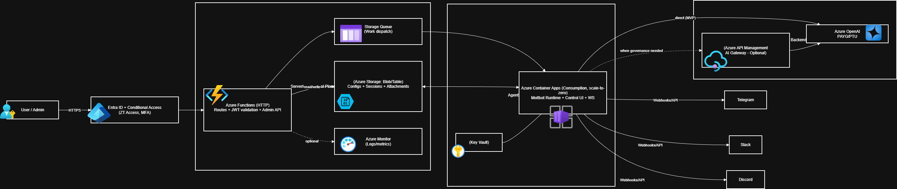

# Molten - Azure AI Agent (Free-Tier Optimized)

[](https://opensource.org/licenses/MIT)
[](https://azure.microsoft.com)
[](https://www.terraform.io/)

A self-hosted personal AI agent running on Azure's free tier services — inspired by Cloudflare's Moltworker, forged for the Azure ecosystem.



## 🎯 Design Goals
- **Minimal cost**: <$10/month using Azure free tiers
- **Security-first**: Managed Identity, Key Vault, Entra ID, content safety
- **No Mac mini**: Fully cloud-hosted, no dedicated hardware
- **Production-ready**: CI/CD, observability, scale-to-zero
- **Extensible skills**: Free Anthropic Computer Use + Azure-native integrations

## 🏗️ Architecture

```
┌──────────────┐     HTTPS      ┌─────────────────────────────────────┐
│  Telegram /  │───────────────►│  Azure Functions (Consumption)      │
│  Slack /     │                │  • Webhook receiver                 │
│  Discord     │◄───────────────│  • JWT validation                   │
└──────────────┘    Response    │  • Queue dispatch                   │
                                └──────────────┬──────────────────────┘
                                               │
                                               ▼
                    ┌─────────────────────────────────────────────────┐
                    │         Azure Storage Queue (Free Tier)         │
                    │              Work item dispatch                 │
                    └──────────────┬──────────────────────────────────┘
                                   │
                                   ▼
                    ┌─────────────────────────────────────────────────┐
                    │    Azure Container Apps (Consumption - FREE)    │
                    │  • Molten Agent runtime                        │
                    │  • OpenClaw.ai integration                      │
                    │  • Scale-to-zero when idle                      │
                    └──────────────┬──────────────────────────────────┘
                                   │
                    ┌──────────────┼──────────────┬───────────────────┐
                    ▼              ▼              ▼                   ▼
         ┌──────────────┐ ┌──────────────┐ ┌──────────────┐ ┌──────────────┐
         │ Azure OpenAI │ │  Key Vault   │ │ Blob Storage │ │  App Insights│
         │ GPT-4o-mini  │ │  (secrets)   │ │   (state)    │ │   (logs)     │
         └──────────────┘ └──────────────┘ └──────────────┘ └──────────────┘
```

See [docs/architecture.md](docs/architecture.md) for detailed diagrams.

## 💰 Cost Breakdown (Target: <$10/month)

| Service | Monthly Cost | Notes |
|---------|--------------|-------|
| Azure Functions | $0.00 | 1M executions + 400K GB-s free/month |
| Azure Container Apps | $0.00 | 180K vCPU-sec + 360K GB-s free/month |
| Azure Blob Storage | ~$0.50 | Includes storage + read/write transactions |
| Azure Key Vault | ~$0.03 | $0.03 per 10,000 operations |
| Application Insights | $0.00 | 5GB ingestion/month free |
| OpenAI API (GPT-4o-mini) | ~$7.50 | ~500K tokens (input/output combined) |
| Anthropic Skills | $0.00 | FREE (runs locally, no API costs) |
| Tavily Web Search | ~$0.01 | Optional (~100 searches/month) |
| Bandwidth | $0.00 | First 100GB outbound/month free |
| **TOTAL** | **~$8.04** | **Under $10/month for ~1,500 messages** |

> **Note**: All skills are FREE (Anthropic Computer Use). Only Tavily web search has minimal costs (~$0.01/search). See [docs/COST.md](docs/COST.md) for optimization tips.

## 📋 Prerequisites

- Azure subscription (free tier works)
- [Azure CLI](https://docs.microsoft.com/cli/azure/install-azure-cli) >= 2.50
- [Terraform](https://www.terraform.io/downloads) >= 1.5
- [Node.js](https://nodejs.org/) >= 20 LTS
- [Python](https://www.python.org/) >= 3.9 (for Anthropic skills)
- [Azure Functions Core Tools](https://docs.microsoft.com/azure/azure-functions/functions-run-local) >= 4.x
- Telegram Bot Token (from [@BotFather](https://t.me/botfather))
- Azure OpenAI access (requires [application](https://aka.ms/oai/access))
- *(Optional)* [Tavily API key](https://tavily.com/) for web search (~$0.01/search)

## 🚀 Quick Start

### 1. Clone and configure

```bash
git clone https://github.com/YOUR_USERNAME/molten.git
cd molten
```

### 2. Azure login

```bash
az login
az account set --subscription "YOUR_SUBSCRIPTION_ID"
```

### 3. Deploy infrastructure

```bash
cd infra/terraform
cp terraform.tfvars.example terraform.tfvars
# Edit terraform.tfvars with your values

terraform init
terraform plan
terraform apply
```

### 4. Deploy Functions

```bash
cd src/functions
npm install
npm run build
func azure functionapp publish $(terraform -chdir=../../infra/terraform output -raw function_app_name)
```

### 5. Configure Telegram Bot

```bash
# Get your webhook URL
WEBHOOK_URL=$(terraform -chdir=infra/terraform output -raw telegram_webhook_url)

# Set Telegram webhook
curl -X POST "https://api.telegram.org/bot${TELEGRAM_TOKEN}/setWebhook?url=${WEBHOOK_URL}"
```

## �️ Skills Framework (100% FREE)

Molten uses **Anthropic Computer Use** for zero-cost skill execution:

### Available Skills

| Skill | Category | Cost | Description |
|-------|----------|------|-------------|
| **bash** | Anthropic | **$0.00** | Execute shell commands (secure sandbox) |
| **text_editor** | Anthropic | **$0.00** | Create, edit, delete files |
| **web-search** | Azure | **~$0.01** | Tavily web search (optional) |
| **calendar** | Azure | **$0.00** | Microsoft Graph calendar |
| **email** | Azure | **$0.00** | Microsoft Graph email |

### Why Anthropic Computer Use?

- ✅ **FREE** - No API subscription, runs locally
- ✅ **Open Source** - MIT license, fully auditable
- ✅ **Self-Hosted** - Data stays in your Azure infrastructure
- ✅ **Extensible** - Add custom skills in TypeScript or Python
- ✅ **Enterprise-Grade** - Built-in security, timeouts, sandboxing

### Example Usage

```typescript
import { getSkillsRegistry } from "./skills/skillsRegistry";

const skillsRegistry = await getSkillsRegistry();

// Execute bash command
const result = await skillsRegistry.executeSkill({
  skillId: "bash",
  parameters: {
    command: "df -h",
    timeout: 10,
  },
  userId: "user123",
});

// Edit files
await skillsRegistry.executeSkill({
  skillId: "text_editor",
  parameters: {
    action: "create",
    file_path: "/tmp/notes.txt",
    content: "Meeting notes...",
  },
  userId: "user123",
});
```

**Learn more**: [docs/SKILLS-INTEGRATION.md](docs/SKILLS-INTEGRATION.md)

## �💡 Cost Optimization Strategies

| Strategy | Savings |
|----------|--------|
| Azure Functions Consumption tier | FREE: 1M executions/month |
| GPT-4o-mini (not GPT-4) | 10x cheaper tokens |
| Semantic response cache | 50-80% fewer API calls |
| `max_tokens=512` cap | Bounded per-request cost |
| Storage Queue (not Service Bus) | Free tier eligible |
| GitHub Container Registry | Free vs Azure ACR ($5/mo) |

## 🔒 Security

- **No secrets in code**: All via Key Vault + Managed Identity
- **Entra ID authentication**: For admin UI
- **Content safety filters**: Block harmful prompts/responses
- **HTTPS-only**: TLS 1.2+ enforced
- **RBAC**: Least-privilege access

See [docs/security-baseline.md](docs/security-baseline.md).

## 📁 Project Structure

```
molten/
├── infra/
│   └── terraform/           # Terraform IaC (primary)
├── deploy/
│   ├── azure-cli/           # Azure CLI scripts
│   ├── powershell/          # PowerShell deployment
│   ├── arm/                  # ARM templates
│   └── bicep/                # Bicep modules
├── src/
│   ├── functions/           # Azure Functions (webhooks + AI)
│   ├── agent/               # Agent runtime (Container Apps - optional)
│   └── shared/              # Shared utilities
├── docs/                     # Architecture & documentation
└── .github/workflows/        # CI/CD pipelines
```

## 🚀 Deployment Options

| Method | Description | Guide |
|--------|-------------|-------|
| **Terraform** | Infrastructure as Code (recommended) | [deploy/terraform](infra/terraform/) |
| **Azure CLI** | Shell scripts for Linux/macOS/WSL | [deploy/azure-cli](deploy/azure-cli/) |
| **PowerShell** | Native Windows deployment | [deploy/powershell](deploy/powershell/) |
| **ARM Templates** | Azure Resource Manager JSON | [deploy/arm](deploy/arm/) |
| **Bicep** | Azure DSL for ARM | [deploy/bicep](deploy/bicep/) |

## 🤝 Contributing

Contributions welcome! Please read [CONTRIBUTING.md](CONTRIBUTING.md) and [SECURITY.md](SECURITY.md) before submitting PRs.

## 📜 License

[MIT License](LICENSE) - see LICENSE file for details.

---

**Molten** - Forged in Azure 🔥
