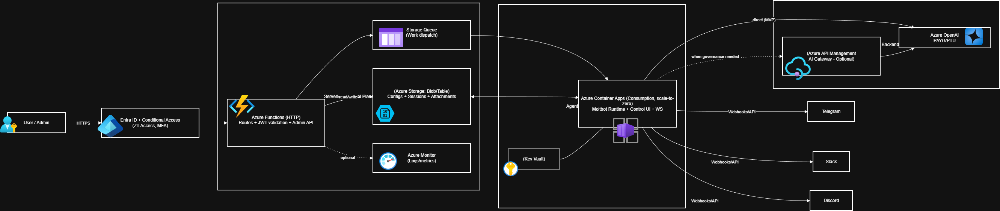

# Molten - Azure AI Agent (Free-Tier Optimized)

[](https://opensource.org/licenses/MIT)
[](https://azure.microsoft.com)
[](https://www.terraform.io/)

A self-hosted personal AI agent running on Azure's free tier services — inspired by Cloudflare's Moltworker, forged for the Azure ecosystem.



## 🎯 Design Goals
- **Minimal cost**: <$10/month using Azure free tiers
- **Security-first**: Managed Identity, Key Vault, Entra ID, content safety
- **No Mac mini**: Fully cloud-hosted, no dedicated hardware
- **Production-ready**: CI/CD, observability, scale-to-zero
- **Extensible skills**: Free Anthropic Computer Use + Azure-native integrations

## 🏗️ Architecture

```
 User ──► Telegram / Slack / Discord / WhatsApp
              │
              ▼
    ┌──────────────────┐     ┌────────────────────┐
    │  Azure Functions │◄────│  Entra ID (ZT+MFA) │
    │  JWT + Routing   │     └────────────────────┘
    └────────┬─────────┘
             │ Storage Queue
             ▼
    ┌─────────────────────────────────────────────────────────────────┐
    │  Container Apps Environment                                    │
    │                                                                │
    │  ┌─────────────────────────┐    ┌───────────────────────────┐  │
    │  │  Agent (Container App)  │───►│  OpenClaw Gateway (opt.)  │  │
    │  │  • Queue Worker         │    │  • ClawHub skills         │  │
    │  │  • Tool-calling loop    │    │  • Multi-channel          │  │
    │  │  • 429 retry + backoff  │    │  • wss:// internal only   │  │
    │  └──────────┬──────────────┘    └───────────────────────────┘  │
    │             │ fallback                                         │
    └─────────────┼──────────────────────────────────────────────────┘
                  │
      ┌───────────┴───────────┐
      ▼                       ▼
 ┌──────────────┐     ┌──────────────┐     ┌──────────────┐
 │ Azure OpenAI │     │  Key Vault   │     │ Blob + Table │
 │ GPT-4o-mini  │     │  Secrets     │     │  Storage     │
 │ Tool calling │     │  MI auth     │     │  State       │
 └──────────────┘     └──────────────┘     └──────────────┘
```

Key features of the current architecture:
- **Tool-calling loop**: Agent calls Azure OpenAI with function definitions, executes tool results, loops up to 5 rounds
- **429 retry with backoff**: Exponential backoff respecting `Retry-After` headers for rate-limited S0 tier
- **OpenClaw fallback**: If OpenClaw Gateway is unavailable, seamlessly falls back to direct Azure OpenAI
- **Queue-based processing**: DLQ after 3 failures; exponential backoff (2s→30s) for scale-to-zero efficiency
- **Conversation memory**: Last 20 messages per session (24h TTL) loaded from Table Storage before each LLM call
- **Graceful shutdown**: SIGTERM/SIGINT handlers drain in-flight messages

See [docs/architecture.md](docs/architecture.md) for detailed diagrams.

## 💰 Cost Breakdown (Target: <$10/month)

| Service | Monthly Cost | Notes |
|---------|--------------|-------|
| Azure Functions | $0.00 | 1M executions + 400K GB-s free/month |
| Azure Container Apps | $0.00 | 180K vCPU-sec + 360K GB-s free/month |
| Azure Blob Storage | ~$0.50 | Includes storage + read/write transactions |
| Azure Key Vault | ~$0.03 | $0.03 per 10,000 operations |
| Application Insights | $0.00 | 5GB ingestion/month free |
| OpenAI API (GPT-4o-mini) | ~$7.50 | ~500K tokens (input/output combined) |
| Anthropic Skills | $0.00 | FREE (runs locally, no API costs) |
| Tavily Web Search | ~$0.01 | Optional (~100 searches/month) |
| Bandwidth | $0.00 | First 100GB outbound/month free |
| **TOTAL** | **~$8.04** | **Under $10/month for ~1,500 messages** |

> **Note**: All skills are FREE (Anthropic Computer Use). Only Tavily web search has minimal costs (~$0.01/search). See [docs/COST.md](docs/COST.md) for optimization tips.

## 📋 Prerequisites

- Azure subscription ([create free account](https://azure.microsoft.com/free/))
- [Azure CLI](https://docs.microsoft.com/cli/azure/install-azure-cli) >= 2.50
- [Node.js](https://nodejs.org/) >= 20 LTS
- [Python](https://www.python.org/) >= 3.9 (for Anthropic skills)
- [Docker](https://www.docker.com/) (for building agent container)
- [Terraform](https://www.terraform.io/downloads) >= 1.5 *(if using Terraform deploy)*
- [Azure Functions Core Tools](https://docs.microsoft.com/azure/azure-functions/functions-run-local) >= 4.x
- Azure OpenAI access (requires [approval](https://aka.ms/oai/access) — typically 1–3 days)
- Telegram Bot Token (from [@BotFather](https://t.me/botfather))
- *(Optional)* [Tavily API key](https://tavily.com/) for web search (~$0.01/search)
- *(Optional)* OpenClaw for enhanced skills — deployed as Azure Container App (see `infra/terraform/main.tf`)

> **Cost disclaimer**: Molten targets <$10/month using Azure free tiers (Functions, Container Apps, 5GB App Insights). Azure OpenAI (S0 tier, ~$7.50 for 500K tokens) is the primary cost driver. Scale-to-zero Container Apps and Consumption Functions ensure you pay nothing at idle. See the [cost breakdown](#-cost-breakdown-target-10month) and [docs/COST.md](docs/COST.md) for details.

> **New to Azure or Molten?** See [docs/GETTING-STARTED.md](docs/GETTING-STARTED.md) for a complete walkthrough from zero to working bot.

## 🚀 Quick Start

### Option A: Terraform (Recommended)

Full infrastructure-as-code with plan/apply workflow.

```bash
git clone https://github.com/kimvaddi/molten.git
cd molten

az login
az account set --subscription "YOUR_SUBSCRIPTION_ID"

cd infra/terraform
cp terraform.tfvars.example terraform.tfvars
# Edit terraform.tfvars with your OpenAI endpoint, key, Telegram token, etc.

terraform init
terraform plan
terraform apply
```

Then deploy the code:

```bash
# Deploy Function App
cd ../../src/functions && npm install && npm run build
func azure functionapp publish $(terraform -chdir=../../infra/terraform output -raw function_app_name)

# Set Telegram webhook
WEBHOOK_URL=$(terraform -chdir=../../infra/terraform output -raw telegram_webhook_url)
curl -X POST "https://api.telegram.org/bot${TELEGRAM_TOKEN}/setWebhook?url=${WEBHOOK_URL}"
```

### Option B: Azure CLI Script (One-Command)

Interactive script that creates everything — including optional auto-creation of Azure OpenAI resources, Function App deployment, and Telegram webhook registration.

```bash
git clone https://github.com/kimvaddi/molten.git
cd molten

az login

# Bash (Linux/macOS/WSL)
chmod +x deploy/azure-cli/deploy.sh
./deploy/azure-cli/deploy.sh

# PowerShell (Windows)
.\deploy\azure-cli\deploy.ps1
```

> **Need step-by-step guidance?** See [docs/GETTING-STARTED.md](docs/GETTING-STARTED.md) for a complete walkthrough.

## �️ Skills Framework (100% FREE)

Molten uses **Anthropic Computer Use** for zero-cost skill execution:

### Available Skills

| Skill | Category | Cost | Description |
|-------|----------|------|-------------|
| **bash** | Anthropic | **$0.00** | Execute shell commands (secure sandbox) |
| **text_editor** | Anthropic | **$0.00** | Create, edit, delete files |
| **web-search** | Azure | **~$0.01** | Tavily web search (optional) |
| **calendar** | Azure | **$0.00** | Microsoft Graph calendar |
| **email** | Azure | **$0.00** | Microsoft Graph email |

### Why Anthropic Computer Use?

- ✅ **FREE** - No API subscription, runs locally
- ✅ **Open Source** - MIT license, fully auditable
- ✅ **Self-Hosted** - Data stays in your Azure infrastructure
- ✅ **Extensible** - Add custom skills in TypeScript or Python
- ✅ **Enterprise-Grade** - Built-in security, timeouts, sandboxing

### Example Usage

```typescript
import { getSkillsRegistry } from "./skills/skillsRegistry";

const skillsRegistry = await getSkillsRegistry();

// Execute bash command
const result = await skillsRegistry.executeSkill({
  skillId: "bash",
  parameters: {
    command: "df -h",
    timeout: 10,
  },
  userId: "user123",
});

// Edit files
await skillsRegistry.executeSkill({
  skillId: "text_editor",
  parameters: {
    action: "create",
    file_path: "/tmp/notes.txt",
    content: "Meeting notes...",
  },
  userId: "user123",
});
```

**Learn more**: [docs/SKILLS-INTEGRATION.md](docs/SKILLS-INTEGRATION.md)

## �💡 Cost Optimization Strategies

| Strategy | Savings |
|----------|--------|
| Azure Functions Consumption tier | FREE: 1M executions/month |
| GPT-4o-mini (not GPT-4) | 10x cheaper tokens |
| Semantic response cache | 50-80% fewer API calls |
| `max_tokens=512` cap | Bounded per-request cost |
| Storage Queue (not Service Bus) | Free tier eligible |
| GitHub Container Registry | Free vs Azure ACR ($5/mo) |

## 🔒 Security

- **No secrets in code**: All via Key Vault + Managed Identity
- **Entra ID authentication**: For admin UI
- **Content safety filters**: Block harmful prompts/responses
- **HTTPS-only**: TLS 1.2+ enforced
- **RBAC**: Least-privilege access

See [docs/security-baseline.md](docs/security-baseline.md).

## 📁 Project Structure

```
molten/
├── infra/
│   └── terraform/              # Terraform IaC (primary)
├── deploy/
│   ├── azure-cli/              # Azure CLI scripts (bash + PowerShell)
│   ├── powershell/             # Azure PowerShell deployment
│   ├── arm/                    # ARM templates
│   └── bicep/                  # Bicep modules
├── src/
│   ├── functions/              # Azure Functions (webhooks + queue dispatch)
│   ├── agent/                  # Agent runtime (Container Apps, Node.js 22)
│   │   ├── Dockerfile          # Multi-stage build: node:22-alpine + python3
│   │   └── src/
│   │       ├── index.ts        # Express server, webhook endpoints, queue enqueue
│   │       ├── queue-worker.ts # Queue consumer, tool-calling loop, OpenClaw fallback
│   │       ├── openclaw/       # OpenClaw Gateway WebSocket client (10s timeout)
│   │       ├── integrations/   # Telegram, Slack, Discord, WhatsApp platform handlers
│   │       ├── llm/            # Azure OpenAI (callModelWithTools, 429 retry, safety)
│   │       ├── skills/         # Skills registry + anthropic_executor.py
│   │       ├── state/          # Blob store + Table store
│   │       └── utils/          # Cache (5-min TTL), auth, logging
│   └── shared/                 # Shared types and config
├── docs/                       # Architecture, cost, security, runbook
└── .github/workflows/          # CI/CD pipelines
```

## 🚀 Deployment Options

| Method | Description | One-Command? | Guide |
|--------|-------------|:------------:|-------|
| **Terraform** | Infrastructure as Code (recommended) | No — infra + manual code deploy | [infra/terraform](infra/terraform/) |
| **Azure CLI** | Interactive shell scripts | **Yes** — infra + code + webhook | [deploy/azure-cli](deploy/azure-cli/) |
| **PowerShell** | Native Windows deployment (Az module) | No — infra + manual code deploy | [deploy/powershell](deploy/powershell/) |
| **ARM Templates** | Azure Resource Manager JSON | No — infra only (no Container App) | [deploy/arm](deploy/arm/) |
| **Bicep** | Azure DSL for ARM | No — infra only (no Container App) | [deploy/bicep](deploy/bicep/) |

## 🤝 Contributing

Contributions welcome! Please read [CONTRIBUTING.md](CONTRIBUTING.md) and [SECURITY.md](SECURITY.md) before submitting PRs.

## 📜 License

[MIT License](LICENSE) - see LICENSE file for details.

---

**Molten** - Forged in Azure 🔥
